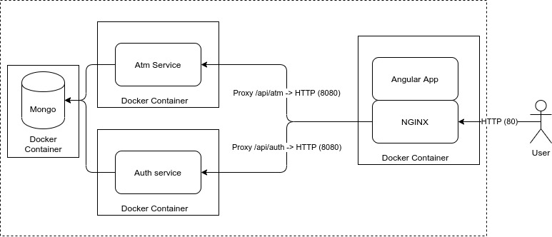

# Microservice architecture

This project follows some principles of microservices architecture:
- **Single responsibility** :
a single microservice must be responsible for a specific feature or functionality or an aggregation of other bounded contexts.

- **Domain driven design**:
a single microservice is built around a business requirement, isolated from others. The business requirement should represents a real-problem, covered in a single microservice.  

- **Encapsulation**:
a microservice should be consumed through a simple API, and must not reveal internal details, but it should hide the internal complexity, also for security reasons.

- **Isolation**:
a microservice should not share resources with other microservices, like databases or file system. It also should be fault tolerant to crashes of other microservices.

- **Location transparency**
a microservice should not reveal its physical location (ip address or something else), but it should consumed through an API gateway.

- **Authentication**
a microservice should be consumed through an authentication system.

But, how does this project reflect this architecture?

## How

This picture represents in a simple way the architecture used:

1. **Docker**: using docker, it's possible to isolate parts of the infrastructure:
    - front end: angular app
    - each microservice: spring boot microservices
    - database: mongodb
    
    docker-compose creates the docker images, reading the `dockerfile` configurations file.
   
2. **Nginx**: using Nginx like an API gateway, it's possible to hide the docker network and the real IPs of microservices, operating like a reverse proxy and exposing only the necessary HTTP ports (:80).
It permits also to create an authentication system in front of the microservices, using properly the `auth_pass` command in nginx.conf, without using some kind of authentication specified of a single microservice (like spring-boot-security), mixing heterogeneous microservices.

3. **Mongodb**: now, for development purpose, the application it's using 1 only NOSQL database instance containerized, but it's possible to create multiple instances of mongodb (also in cluster), each one used by different microservices.    

4. **Spring boot microservice**: at the moment there are two microservices *atm*, *auth*, providing respectively the *Atm Business Context* and the *Authentication Business Context* using spring-boot application, but it's possible add others, creating the backend-service and add the related configuration to `nginx.conf`

5. **Authentication**: the URLs are secured by an authentication system, using a http header `token`, provided by *auth* microservice.  

6. **Angular application**: the GUI of the application, providing the requirements to do a full text search of the Atm of a Dutch city. 
      
Now, the details.  
   
### Back end

**Microservices**:
1. *atm*:
    - At the boot time, it downloads the collection of atms and it stores in the mongodb database, creating for each document an indexable field with the concatenation of its attributes.
    - So, it meets the requirements in a simple way, exposing a very efficient route in the controller to get all the atms or search them (with a full text). 
    - The search route is paginated, so the GUI can use the pagination. 
    
2. *auth*
    - At the boot time, it register a *fake* user
    - It exposes three routes:
        - `register`: register a new account, using username and password
        - `login`: authenticate user, using username and password provided, and responds with a new valid *token*
        - `auth:`: check if a token is valid

**Database**:
1. *User* Collection data
2. *Atm* Collection data

### Front end

Single page app with:
- login feature
- full text search 

The Angular APP (tries to) respect the "Angular way", using separated components:
- **atm-table**: component with an angular material table with pagination and a text field search

- home: ...

- container: ...

- login: ...

- footer: ...

- header: ...

**services**:
- *atm.service.ts*: it provides the logic to talk with `atm` microservice
- *authentication.service.ts*: it provides the logic to talk with `auth` microservice

**interceptor**:
- *auth*: intercepts the http requests, adding in the http header the private `token` in a transparente way. it intercepts also the error 401 (UNAUTHORIZED), returning the flow to the login page.
- *auth-guard*: check every page changes if the `currentUser` object is persisted in the LocalStorage of the browser. If it's not present, return to login page.

## YET TO BE DEVELOPED...
- Back end: 
    - encryption of the password, using a hashing algorithm (with random salt) 
- Front end:
    - dockerization of the Angular APP (now it's bundled inside the NGINX container) 
    - registration of an account
    - add a responsive menu
    - add a master/detail template to each row of atm results, showing all the fields (in a fashion way)
    - geolocalize the results using google maps.

